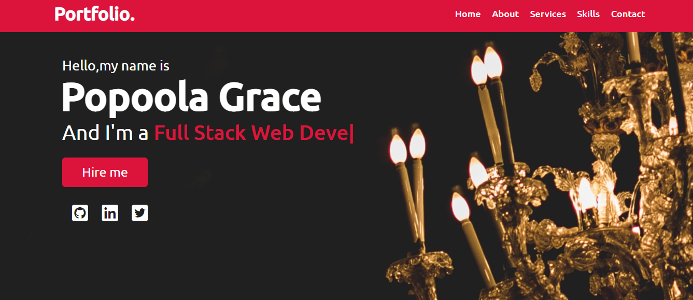

# Portfolio

The project is a complete design of my portfolio page

The design is based on a follow along tutorial of CodingNepal. If you like it you can follow along as well to build your using same tutorial.

## Screenshots

## Built With
- HTML
- CSS
- Javascript

## Live Demo
[Live Demo Link](https://rawcdn.githack.com/GraceOyiza/Portfolio/d8e55bbaee7dc5f3ee755f6787389042c8ab1706/index.html)

## Getting Started
- Clone this repo

- cd into the cloned repo

- Open the index.html file with any browser of your choice

## Author

👤 **Popoola Grace Boluwatife**

- Github: [@GraceOyiza](https://github.com/GraceOyiza)
- Twitter: [@_PopsonGrace](https://twitter.com/_PopsonGrace)
- LinkedIn: [@grace](https://www.linkedin.com/in/grace-popoola-657a181aa/)

## Show your support

Give a ⭐️ if you like this project!
